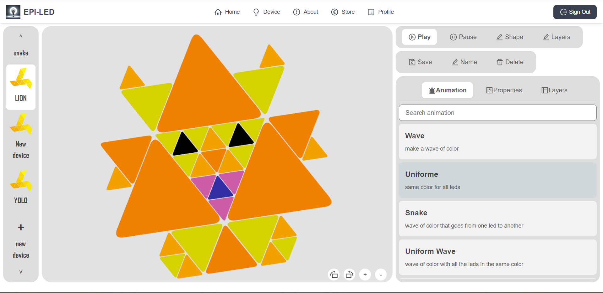

# EPI-LED

it's a simple web app to control a led strip.
You can create some templates and add animations to it.
You can also save your templates and animations online.




## Developing

Once you've created a project and installed dependencies with `npm install` (or `pnpm install` or `yarn`), start a development server:

```bash
npm run dev

# or start the server and open the app in a new browser tab
npm run dev -- --open
```

or with Dockerfile et docker-compose.yml
```bash
docker-compose up -d
```


## Building
```bash


To create a production version of your app:

```bash
npm run build
```

### How to Create a New Animation?

go here: [How to Create a New Animation?](./src/animations/README.md)
